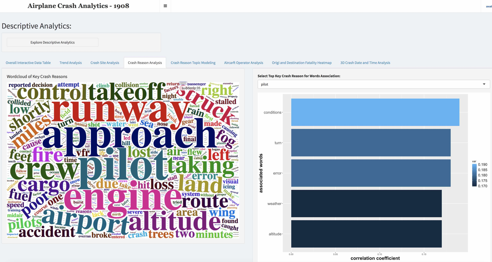
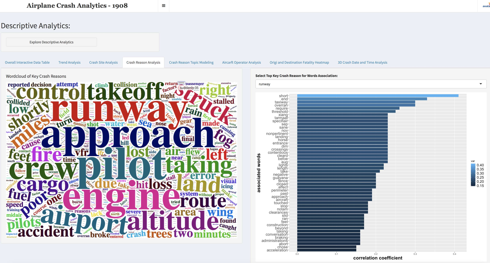
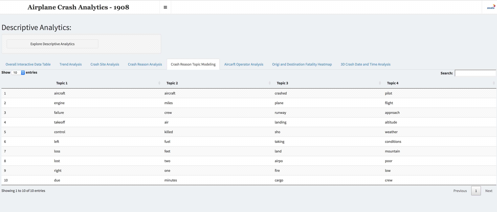

# aircraft-crash-data-R-and-Shiny

### The dashboard is live in shinyapps.io and the url is https://brianhoibm.shinyapps.io/crash/ (please use chrome on desktop)

Take note two tabs of the dashboard board are not working in shinyapp.io due to some conflicts and it is left as it is. The two tabs are supposed to show the insights as show below, user can launch the app locally to view the fully functional dashboard.

To view the dashboard locally, please select "open in browser" as plotly package doesn't work well with R-app.

### The analytics dashboard has the following brief descriptions.
> a. descriptive: trend analysis, crash reason analysis (word cloud and the associated words of the top keywords), crash site analysis, 3D plot of time variables (month, day of week, hour) 

> b. external data correlation: relationships between world events and aviation tech events with historical crash cases, fatality and fatality rate

> c. predictive analytics: a regressor is trained to fit crash 1908 data together with external data - historical passenger carried by country and income level by country
>> 1. The country/city of crash 1908 data is matched to the external datasets by using fuzzy matching - Levenshtein distance distance matching

